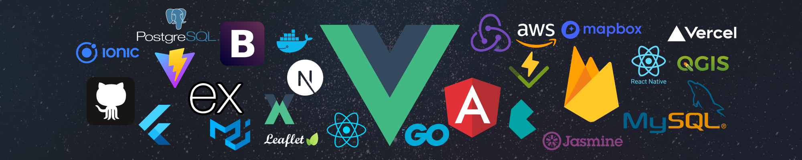

<h2 align="center">Frontend Developer | Map-Based Developer | GIS Enthusiast</h2>

<table style="width:100%">
  <tr>
    <th>Tentang Saya</th>
  </tr>
  <tr>
    <td style="text-align: justify">
      Saya 🤠 <a target="_blank" href="https://ujangaripin24.github.io/">@Ujang Aripin</a> seorang passionate Frontend Developer, 💻 Saya memiliki pengalaman bekerja sebagai Frontend Developer lebih dari 🚀 1 tahun dan berpengalaman sebagai PHP Web Developer kurang lebih 🚀 2 tahun, 🌏 tidak hanya itu saya adalah pengembang Aplikasi berbasis Peta Digital dan memiliki keterampilan lain di bidang 🎨 Desain Grafis dan pengembangan ⚙️ Backend serta 📱 Aplikasi Mobile.
    </td>
  </tr>
</table>

#

    
<b>📊 Github Stats 📊</b>

    
    

#

  
<b>📊 Technology I Use 📊</b>

  <table>
    <tr>
      <td valign="center" align="center" width="100px"><b>🚀 Frontend and Tools 🚀</b></td>
      <td valign="center" align="center" width="100px"><b>🚀 Backend and Tools 🚀</b></td>
    </tr>
    <tr>
      <td valign="center" align="center" width="300px">
        <code></code>
        <code></code>
        <code></code>
        <code></code>
        <code></code>
        <code></code>
        <code></code>
        <code></code>
        <code></code>
        <code></code>
        <code></code>
        <code></code>
        <code></code>
        <code></code>
      </td>
      <td valign="center" align="center" width="300px">
        <code></code>
        <code></code>
        <code></code>
        <code></code>
      </td>
    </tr>
  </table>
    <table>
    <tr>
      <td valign="center" align="center" width="100px"><b>🚀 Mobile & Hybrid App 🚀</b></td>
      <td valign="center" align="center" width="100px"><b>📖 I'm also learning 📖</b></td>
    </tr>
    <tr>
      <td valign="center" align="center" width="300px">
        <code></code>
        <code></code>
        <code></code>
      </td>
      <td valign="center" align="center" width="300px">
        <code></code>
        <code></code>
        <code></code>
        <code></code>
      </td>
    </tr>
  </table>
    <table>
    <tr>
      <td valign="center" align="center" width="100px"><b>🚀 Software 🚀</b></td>
    </tr>
    <tr>
      <td valign="center" align="center" width="300px">
        <code></code>
        <code></code>
        <code></code>
        <code></code>
        <code></code>
        <code></code>
        <code></code>
        <code></code>
        <code></code>
        <code></code>
      </td>
    </tr>
  </table>

#

  

<b>🏆 Github Profile Trophy 🏆</b>

  

#

  

    
<b>🌐 Social Media 🌐</b>

  

  

    
    
    
    
  

  

#

